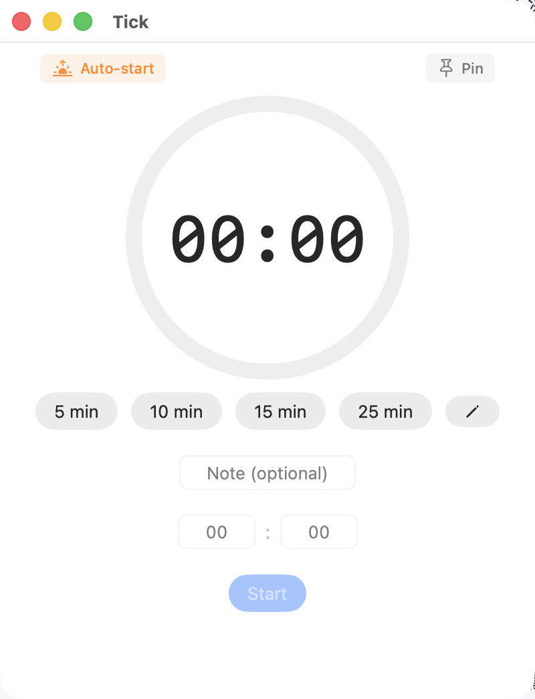
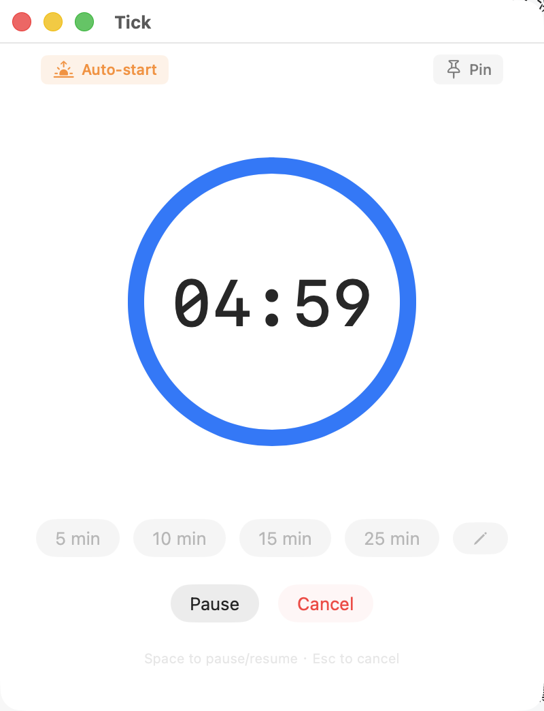
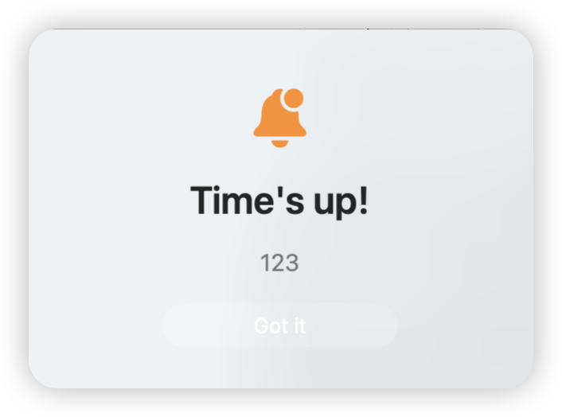

# Tick

[English](#english) | [中文](#中文)

---

## English

A minimal macOS countdown timer with menu bar integration.

<p align="center">
  
  
  
</p>

### Features

- Circular progress ring with customizable preset timers
- Custom time input (minutes + seconds) with optional note
- Menu bar live countdown — click to quick-start, pause, cancel, or enter custom input with note
- Desktop alert with looping sound on completion (auto-stops after 45s)
- Always-on-top mode, launch at login, keyboard shortcuts, Dock badge
- Repeat last timer with one click
- Preset editor — add, remove, reorder, persist across sessions

### Keyboard Shortcuts

| Key | Action |
|-----|--------|
| Space | Pause / Resume |
| Esc | Cancel |
| Return | Start |

### Build

```bash
git clone https://github.com/qingchejun/Tick.git
cd Tick
./build.sh
open /Applications/Tick.app
```

Requires macOS 13+ and Xcode Command Line Tools.

### Install

Download `Tick.dmg` from [Releases](https://github.com/qingchejun/Tick/releases), drag `Tick.app` to `/Applications`.

### What's New (v1.1)

- **Custom presets** — edit, add, remove, reorder preset buttons (up to 5), persisted to disk
- **Repeat last timer** — one-click button to restart previous countdown (main window + menu bar)
- **Menu bar note input** — add notes when quick-starting from menu bar popover
- **Launch at Login** — auto-start toggle in top toolbar
- **Always-on-top persisted** — pin state survives window close/reopen
- **Completion animation** — progress ring flashes green when timer finishes
- **Alert improvements** — button text changed to "Got it" with orange accent color
- **Sound auto-stop** — alert sound stops automatically after 45 seconds
- **Sleep resilience** — timer refreshes immediately after system wake
- **Keyboard hints** — shortcut tips shown below control buttons
- **Return key in text fields** — press Return to start timer from any input field

### License

MIT

---

## 中文

一个简洁的 macOS 倒计时工具，支持菜单栏常驻。

<p align="center">
  
  
  
</p>

### 功能

- 环形进度条 + 可自定义预设时间
- 自定义时长输入（分钟 + 秒）+ 可选备注
- 菜单栏实时倒计时 — 点击图标可快速启动、暂停、取消，支持输入备注
- 倒计时结束弹出桌面提醒，循环提示音（45 秒后自动停止）
- 窗口置顶、开机自启动、键盘快捷键、Dock 角标
- 一键重复上次计时
- 预设编辑器 — 增删改排序，持久化存储

### 快捷键

| 按键 | 功能 |
|------|------|
| 空格 | 暂停 / 继续 |
| Esc | 取消 |
| 回车 | 开始 |

### 构建

```bash
git clone https://github.com/qingchejun/Tick.git
cd Tick
./build.sh
open /Applications/Tick.app
```

需要 macOS 13+ 和 Xcode Command Line Tools。

### 安装

从 [Releases](https://github.com/qingchejun/Tick/releases) 下载 `Tick.dmg`，将 `Tick.app` 拖入 `/Applications`。

### 更新日志 (v1.1)

- **自定义预设** — 编辑、添加、删除、排序预设按钮（最多 5 个），持久化存储
- **重复上次计时** — 一键重启上次倒计时（主窗口 + 菜单栏均可）
- **菜单栏备注输入** — 从菜单栏快速启动时可添加备注
- **开机自启动** — 左上角 Auto-start 开关
- **置顶状态持久化** — 关闭窗口后重新打开仍保持置顶
- **完成动画** — 倒计时归零时进度环闪绿
- **提醒优化** — 按钮文案改为 "Got it"，橙色醒目配色
- **声音自动停止** — 提醒音 45 秒后自动停止
- **休眠恢复** — 系统唤醒后立即刷新计时
- **快捷键提示** — 控制按钮下方显示快捷键
- **回车键支持** — 在任意输入框按回车即可开始计时

### 许可证

MIT
